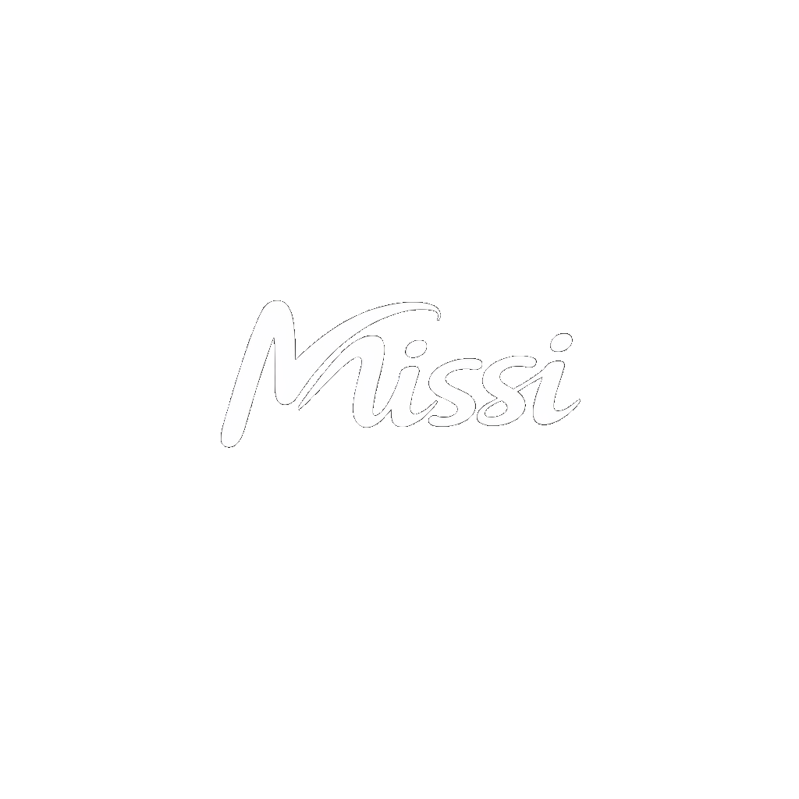

# missiAI — AI with Memory

<div align="center">
  
  <h3>The most powerful human AI assistant yet.</h3>
  <p><em>Pioneering new standards in intelligent assistance</em></p>
  
  
  
  
  
  [🌐 Live Demo](https://missi.space/) | [📋 Join Waitlist](https://missi.space/waitlist) | [📖 Manifesto](https://missi.space/manifesto)
</div>

---

## 🚀 About missiAI

missiAI is a **Next Generation AI Platform** that aims to deliver an advanced human-AI assistant with unprecedented intelligence, creativity, and human-like interaction. Our mission is to pioneer "AI with Memory" — creating intelligent systems that remember, learn, and adapt to provide truly personalized assistance.

### ✨ Key Features

- **🧠 AI with Memory**: Revolutionary memory architecture that enables continuous learning
- **🎨 Interactive Landing Page**: Beautiful animated particle/starfield background with responsive design
- **📝 Waitlist System**: Early access signup for beta users
- **📜 Vision Manifesto**: Comprehensive outlook on human-AI collaboration
- **🎯 Mission-Driven**: Focused on delivering the most powerful human AI assistant
- **📱 Responsive Design**: Seamless experience across all devices

---

## 🛠️ Tech Stack

| Technology | Version | Purpose |
|------------|---------|----------|
| **Next.js** | 15.2.4 | React framework with App Router |
| **React** | ^19 | UI library |
| **TypeScript** | ^5 | Type-safe development |
| **Tailwind CSS** | ^3.4.17 | Utility-first styling |
| **Radix UI** | Various | Accessible component primitives |
| **Framer Motion** | Via particles | Smooth animations |
| **pnpm** | Latest | Fast, disk space efficient package manager |

### 🔧 Additional Dependencies

- **UI Components**: Comprehensive Radix UI suite for accessible interfaces
- **Forms**: React Hook Form with Zod validation
- **Styling**: Tailwind CSS with custom animations
- **Icons**: Lucide React icon library
- **Particles**: Custom missi-ai-particles component

---

## 📁 Project Structure

```
missiAI/
├── app/
│   ├── manifesto/          # Vision and mission pages
│   ├── waitlist/            # Early access signup
│   ├── globals.css          # Global styles
│   ├── layout.tsx           # Root layout component
│   └── page.tsx             # Home page
├── components/              # Reusable UI components
├── hooks/                   # Custom React hooks
├── lib/                     # Utility functions
├── public/
│   └── images/              # Static assets and logos
├── styles/                  # Additional stylesheets
├── missi-ai-particles.tsx   # Custom particle animation
├── components.json          # Shadcn/ui configuration
├── next.config.mjs          # Next.js configuration
├── tailwind.config.ts       # Tailwind CSS configuration
├── tsconfig.json            # TypeScript configuration
└── package.json             # Project dependencies
```

---

## 🚀 Getting Started

### Prerequisites

- **Node.js** 18+ 
- **pnpm** (recommended) or npm/yarn

### Installation

1. **Clone the repository**
   ```bash
   git clone https://github.com/rudrasatani13/missiAI.git
   cd missiAI
   ```

2. **Install dependencies**
   ```bash
   pnpm install
   ```

3. **Start development server**
   ```bash
   pnpm dev
   ```

4. **Open in browser**
   ```
   http://localhost:3000
   ```

### 🏗️ Build Commands

```bash
# Development server
pnpm dev

# Production build
pnpm build

# Start production server
pnpm start

# Static export
pnpm export
```

---

## 🌍 Environment Variables

For future API integrations and configuration, create a `.env.local` file:

```env
# Example environment variables (to be configured as needed)
# NEXT_PUBLIC_API_URL=https://api.missi.ai
# NEXT_PUBLIC_ANALYTICS_ID=your_analytics_id
# DATABASE_URL=your_database_connection
```

---

## 📱 Usage

Once running locally, you'll have access to:

- **Home Page** (`/`) - Interactive landing with particle animations
- **Waitlist** (`/waitlist`) - Early access signup form
- **Manifesto** (`/manifesto`) - Vision and mission statement

### 🎨 Features in Action

- **Animated Background**: Custom particle system creates an immersive experience
- **Protected Assets**: Logo and brand elements include protection against unauthorized use
- **Responsive Navigation**: Seamless experience across desktop and mobile
- **Modern UI**: Clean, minimal design with smooth transitions

---

## 🤝 Contributing

We welcome contributions to missiAI! Please follow these steps:

1. **Fork** the repository
2. **Create** a feature branch (`git checkout -b feature/AmazingFeature`)
3. **Commit** your changes (`git commit -m 'Add some AmazingFeature'`)
4. **Push** to the branch (`git push origin feature/AmazingFeature`)
5. **Open** a Pull Request

### 📋 Development Guidelines

- Follow TypeScript best practices
- Use conventional commit messages
- Ensure responsive design compatibility
- Test across multiple browsers
- Maintain accessibility standards

---

## 📄 License

This project is private and proprietary. All rights reserved by **Rudra Satani** and the missiAI team.

For licensing inquiries, please contact: [rudrasatani@missi.space](mailto:rudrasatani@missi.space)

---

## 👨‍💼 Leadership

**CEO & Founder**: Rudra Satani ([@rudrasatani13](https://github.com/rudrasatani13))

*Visionary leader driving the future of human-AI collaboration*

---

## 🙏 Acknowledgments

- **Next.js Team** for the incredible React framework
- **Vercel** for seamless deployment platform
- **Radix UI** for accessible component primitives
- **Tailwind CSS** for utility-first styling
- **Open Source Community** for continuous inspiration

---

## 📞 Contact & Support

- **Website**: [missi.space](https://missi.space)
- **Email**: [rudrasatani@missi.space](mailto:rudrasatani@missi.space)
- **GitHub**: [@rudrasatani13](https://github.com/rudrasatani13)
- **Issues**: [GitHub Issues](https://github.com/rudrasatani13/missiAI/issues)

---

<div align="center">
  <p><strong>missiAI © 2025</strong></p>
  <p><em>Pioneering the future of AI with Memory</em></p>
  
  ⭐ **Star this repo if you believe in the future of human-AI collaboration!** ⭐
</div>
